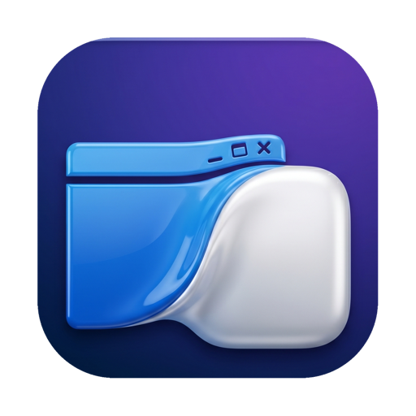
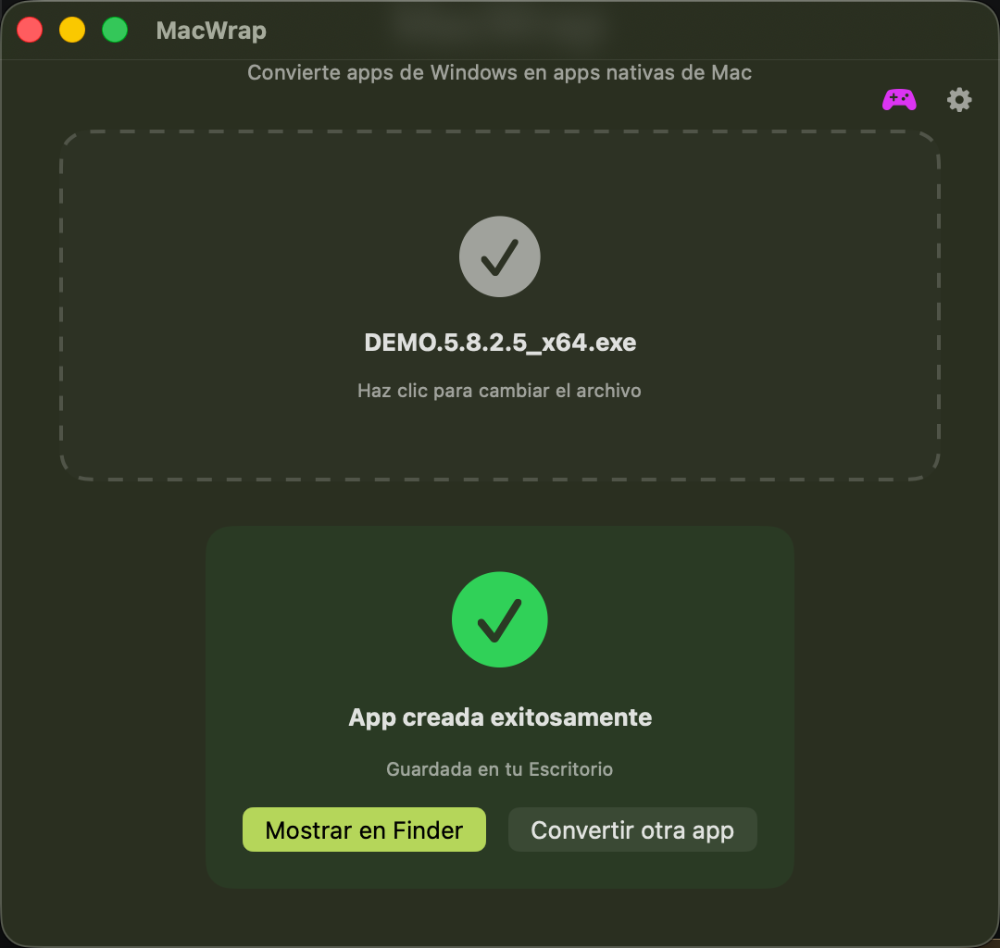
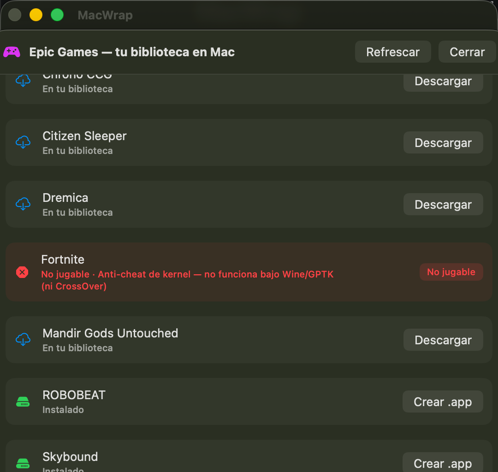

  

<h1 align="center">MacWrap</h1>

  <b>Run your Windows apps as native Mac apps.</b> 
  Drag a Windows <code>.exe</code> onto MacWrap and get a real <code>.app</code> back — its own icon, 
  double-click to launch, no terminal, no setup. You'd never know there's Windows underneath.

  
  
  
  
  

  <a href="https://github.com/WallsRaul/macwrap-site/releases/latest/download/MacWrap.dmg"><b>⬇&nbsp; Download for Mac (.dmg)</b></a>
  &nbsp;·&nbsp; <a href="https://macwrap.app">Website</a>
  &nbsp;·&nbsp; <a href="https://macwrap.lemonsqueezy.com/checkout/buy/675b04d0-2520-4bc6-8df1-1e3cc1edc191">♥ Donate</a>

* * *

## ✨ What is MacWrap?

MacWrap turns any Windows program into a **native-feeling Mac app**. No virtual machine, no Windows
desktop, no per-app guesswork — each app becomes its own `.app` bundle with the real icon, and you
double-click to run it.

It runs on a **patched, hardware-accelerated build of Wine** (plus Apple's Game Porting Toolkit for
games) that we maintain ourselves — so things work that other layers can't.

## 🖼 Screenshots

  
  &nbsp;
  

<i>Left: drop a <code>.exe</code> → get a native <code>.app</code>.&nbsp;&nbsp;Right: your Epic library on Mac, with honest "not playable" flags. (UI shown in Spanish — the app is bilingual EN/ES.)</i>

## 🚀 Features

- **Drag & drop** — drop any `.exe` or installer, get a native `.app`.
- **Honest compatibility** — MacWrap analyzes each app and tells you which tier it lands in, *before* you commit.
- **Games** — wrap DX11/DX12 titles via Apple's Game Porting Toolkit + D3DMetal.
- **Epic Games library** — connect your Epic account and bring your games (and the free weekly giveaways) to Mac.
- **Real native bundle** — original icon, double-click, no terminal.
- **Bilingual** — English & Spanish, auto by system language.

## 📊 Compatibility — honest by design

No compatibility layer runs *everything*, and anyone who says otherwise is lying. MacWrap tells you up front:

| Tier | What runs |
|------|-----------|
| 🟢 **Runs great** | Win32 / .NET Framework apps · GDI/GDI+ interfaces · most legacy professional software |
| 🔵 **Runs with a recipe** | Needs runtimes/tweaks we apply automatically — .NET, Access DB, Direct2D editors |
| 🟠 **Partial** | Heavy Direct2D/Direct3D edge cases; some features may be limited |
| 🔴 **Not yet** | Modern WinRT · kernel drivers · online anti-cheat (Fortnite, etc.) |

**Already running:** The Witcher 3 · legacy .NET/Access business suites · Sierra Chart · AmiBroker ·
Notepad++ · 7-Zip · VLC · IrfanView · EmEditor · WinMerge · MobaXterm · WinSCP · HeidiSQL — and more.

## ⬇ Download & Install

1. [**Download MacWrap.dmg**](https://github.com/WallsRaul/macwrap-site/releases/latest/download/MacWrap.dmg) (Apple Silicon).
2. Open the `.dmg`, drag **MacWrap** to Applications.
3. First launch: **right-click → Open** (one-time macOS prompt for unsigned apps).
4. Drag a Windows `.exe` onto it. Done.

> [!NOTE]
> MacWrap needs **Rosetta 2** (the engine is x86_64). The app detects and installs it automatically
> with one click on first run — nothing technical on your side.

## ❤️ Support the project

MacWrap is free and built by **one developer**. Every recipe — making a stubborn Windows app finally
run on Mac — is hours of deep work. If MacWrap saved you from buying a Windows PC or a pricey VM, a
small donation keeps it going:

- [**♥ Donate** (card / Apple Pay)](https://macwrap.lemonsqueezy.com/checkout/buy/675b04d0-2520-4bc6-8df1-1e3cc1edc191)
- [Donate with **PayPal**](https://www.paypal.me/WallsRaul)

100% optional — MacWrap stays free either way. 🙏

## 🛠 How it works

Swift orchestrates everything: it analyzes the `.exe`, picks the right recipe, sets up an isolated
Wine "bottle", injects the program, and packages it as a standard macOS `.app`. The graphics stack is
a self-patched Wine (wined3d / d2d1 on MoltenVK / Metal) plus Apple's Game Porting Toolkit + D3DMetal
for Direct3D games.

* * *

MacWrap runs on a modified build of <a href="https://www.winehq.org">Wine</a> (LGPL). Modified source:
<a href="https://github.com/WallsRaul/macwrap-wine">github.com/WallsRaul/macwrap-wine</a>.
Windows is a trademark of Microsoft. Apple, Mac and Apple Silicon are trademarks of Apple Inc.
MacWrap is not affiliated with Microsoft or Apple. It packages software you already own and are
licensed to use; it does not distribute third-party applications.
